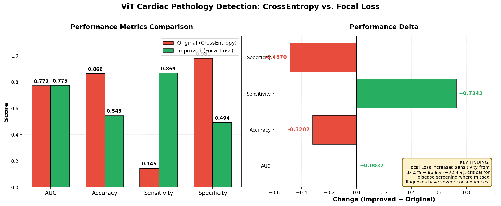
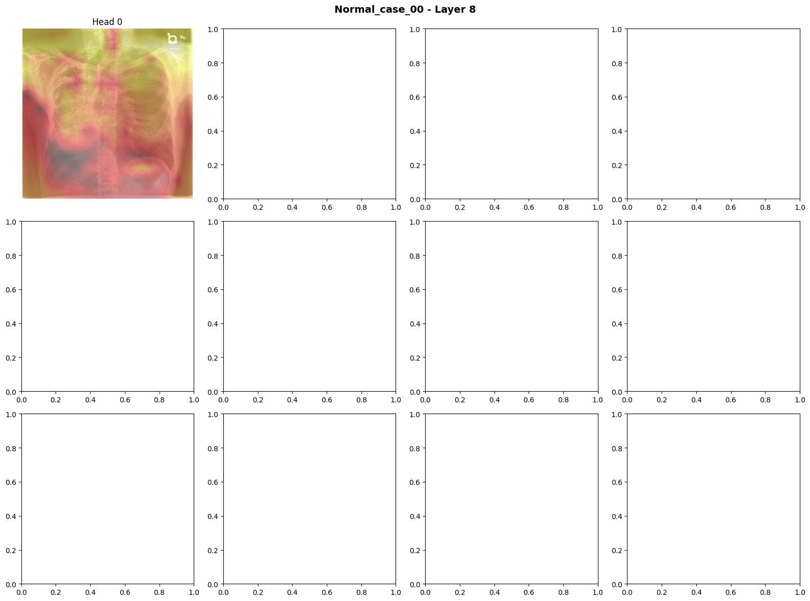
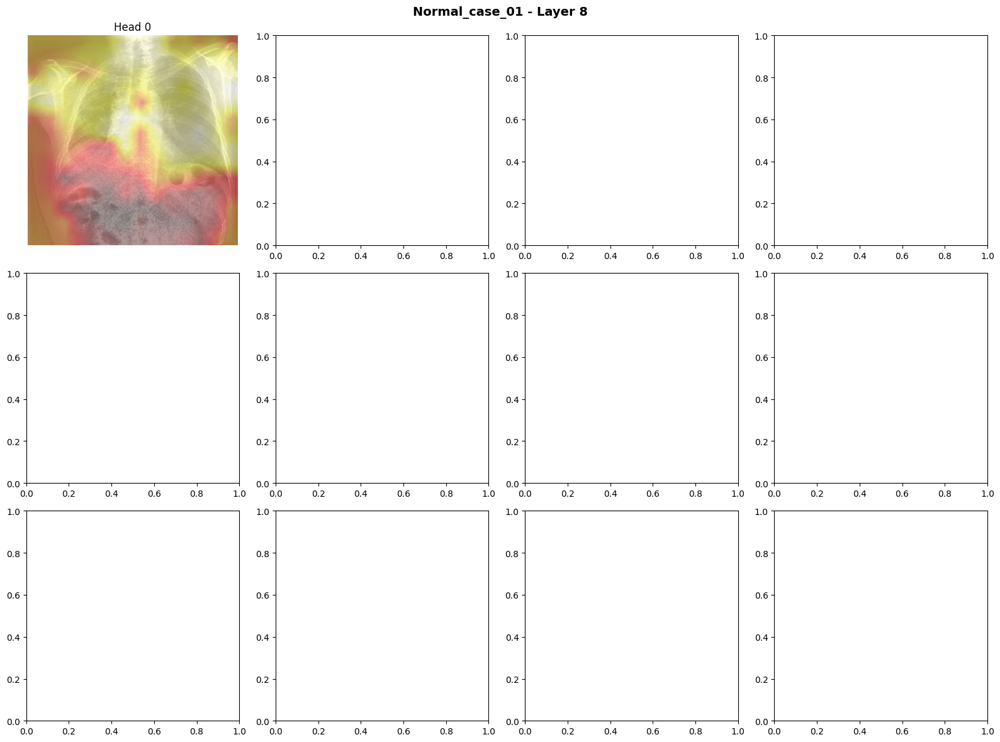
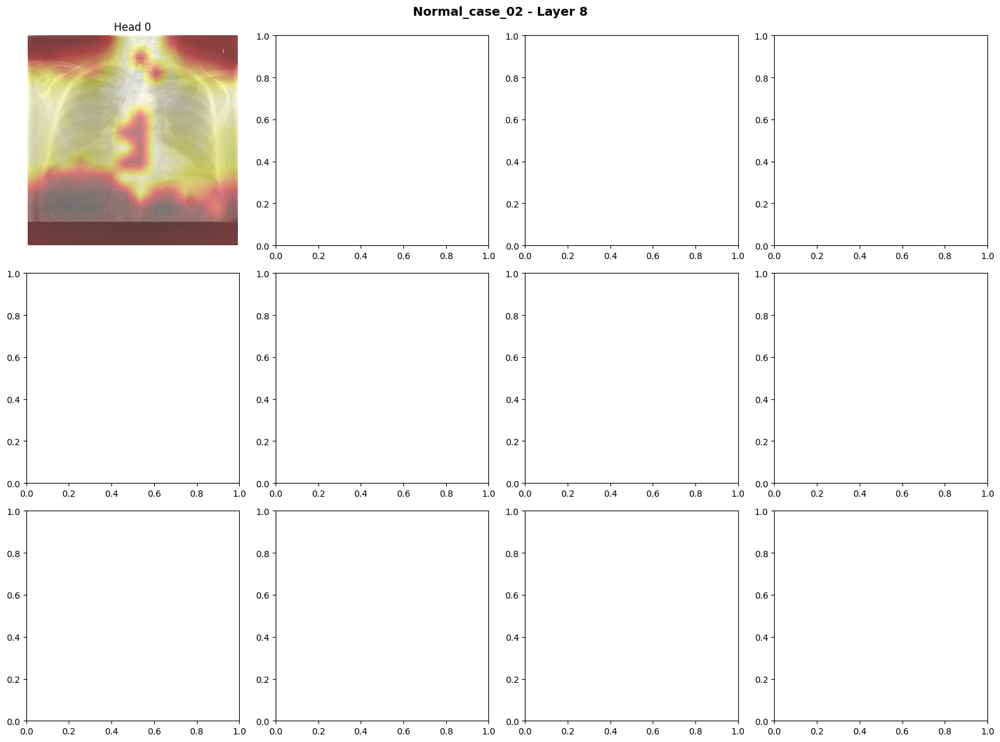
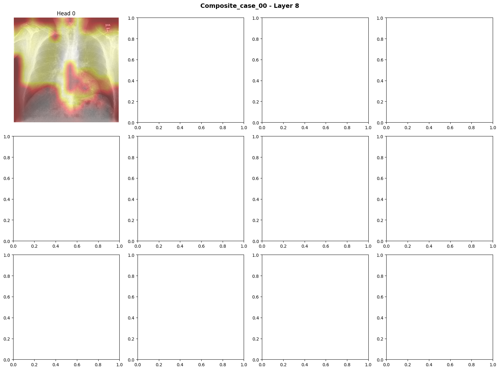
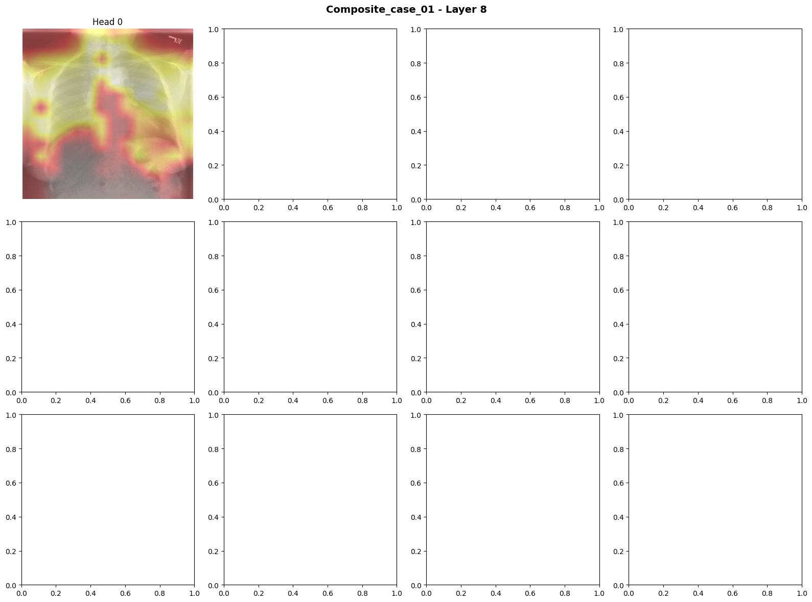
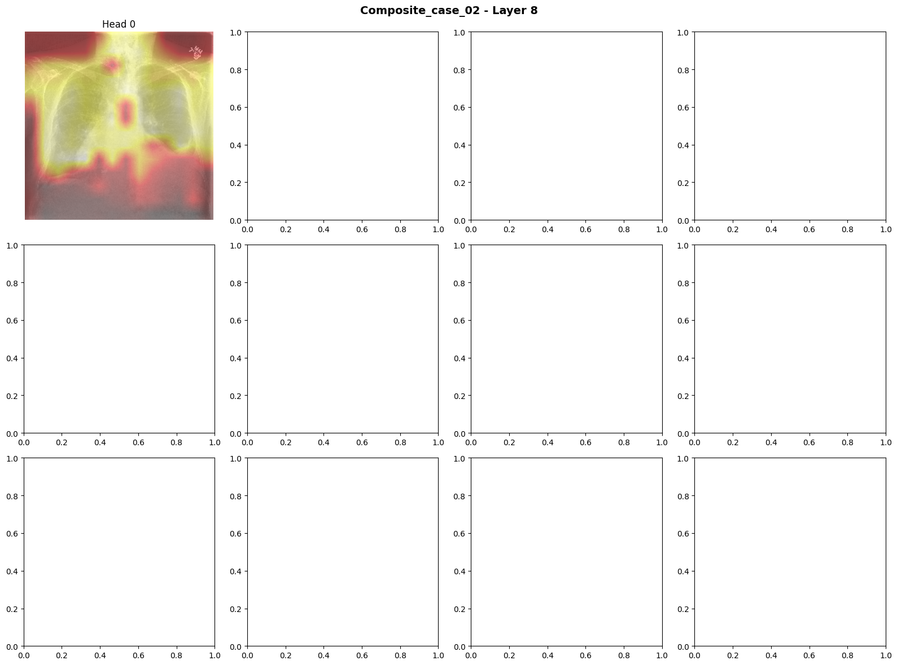

# Vision Transformer for Cardiac Pathology Detection

An interpretable deep learning pipeline that uses Vision Transformers (ViT) to detect cardiac pathology from chest X-rays, trained on the CheXchoNet dataset with gold-standard echocardiography labels.


---

## 🎯 Project Overview

This project applies a **ViT-Base (85.8M parameters)** pretrained on ImageNet-21k to detect cardiac pathology (SLVH, DLV, and Composite findings) from 71,589 chest radiographs. The pipeline addresses the challenge of **severe class imbalance (86% normal / 14% pathology)** using Focal Loss, and provides **interpretable attention visualizations** to support clinical trust.

### Key Contributions
- Transfer learning with ViT-Base on 71K chest X-rays
- Focal Loss implementation to handle class imbalance
- Attention heatmap extraction across all 12 transformer layers
- Systematic layer-wise interpretability analysis

---

## 📊 Results

### Performance Comparison: CrossEntropy vs. Focal Loss



| Metric | Original (CrossEntropy) | Improved (Focal Loss) | Change |
|--------|:----------------------:|:---------------------:|:------:|
| AUC | 0.7717 | 0.7749 | +0.0032 |
| Accuracy | 0.8655 | 0.5453 | -0.3202 |
| **Sensitivity** | **0.1448** | **0.8690** | **+0.7242** ✅ |
| Specificity | 0.9806 | 0.4936 | -0.4870 |

### 🔑 Key Finding

The original model achieved high accuracy (86.5%) but **missed 85.5% of pathology cases** — the classic failure mode of CrossEntropy on imbalanced data. Switching to Focal Loss (α=[1.0, 6.26], γ=2.0) raised sensitivity from **14.5% to 86.9%** — a critical improvement for disease screening where missed diagnoses carry serious consequences.

> For cardiac screening, a model that catches 87% of pathology with some false alarms is far more clinically useful than one that misses 85% of disease while appearing "accurate."

---

## 🔍 Interpretability: Attention Visualizations

The model's attention at **Layer 8** (the most interpretable layer, with 67% of heads showing meaningful specialization) focuses on cardiac anatomy, supporting clinical trust.

### Normal Cases
The model attends broadly across the thoracic cavity:

| | | |
|:-:|:-:|:-:|
|  |  |  |

### Composite Pathology Cases
Attention concentrates on the cardiac region (mediastinum):

| | | |
|:-:|:-:|:-:|
|  |  |  |

**Color legend:** 🔴 Red = high attention · 🟡 Yellow = medium · 🔵 Blue = low attention

---

## 🏗️ Project Structure

```
vision-transformer-cardiac-pathology/
├── scripts/
│   ├── 01_prepare_dataset.py          # Stratified 60/15/25 split
│   ├── 02_train_vit.py                # Baseline training (CrossEntropy)
│   ├── 02b_train_vit_improved.py      # Improved training (Focal Loss)
│   └── 03_extract_attention.py        # Attention map extraction
├── src/                               # Shared modules
├── docs/                              # Detailed documentation
├── images/                            # Result charts & attention maps
├── config.py                          # Project configuration
├── requirements.txt
└── README.md
```

---

## ⚙️ Setup & Usage

### Prerequisites
- Python 3.12, CUDA 12.1, NVIDIA GPU (≥6GB VRAM recommended)
- The [CheXchoNet dataset](https://physionet.org/content/chexchonet/) from PhysioNet

### Install
```bash
git clone https://github.com/TJPNyaguraMD/vision-transformer-cardiac-pathology.git
cd vision-transformer-cardiac-pathology
python -m venv .venv
.\.venv\Scripts\activate
pip install -r requirements.txt
```

### Configure
Edit `config.py` to point to your local dataset paths.

### Run the Pipeline
```bash
python scripts/01_prepare_dataset.py        # 1. Create splits
python scripts/02_train_vit.py              # 2. Baseline training
python scripts/02b_train_vit_improved.py    # 3. Focal Loss training
python scripts/03_extract_attention.py      # 4. Attention visualization
```

---

## 🔬 Technical Details

| Component | Configuration |
|-----------|---------------|
| Architecture | ViT-Base, patch size 16, 196 patches, 12 layers, 12 heads |
| Parameters | 85.8M (all trainable) |
| Input size | 224×224 |
| Optimizer | AdamW (lr=1e-4, weight_decay=0.01) |
| Scheduler | Cosine annealing with 5-epoch warmup |
| Batch size | 32 |
| Loss (baseline) | CrossEntropy |
| Loss (improved) | Focal Loss (α=[1.0, 6.26], γ=2.0) |
| Early stopping | Patience = 15 epochs |
| Dataset splits | Train 42,953 / Val 10,738 / Test 17,898 (stratified) |

---

## 📚 Documentation

For deeper reading, see the [`docs/`](docs/) folder:
- [`PROJECT_SUMMARY.md`](docs/PROJECT_SUMMARY.md) — Complete project overview
- [`TRAINING_APPROACH_DETAILED.md`](docs/TRAINING_APPROACH_DETAILED.md) — Training methodology
- [`TRAINING_RESULTS_README.md`](docs/TRAINING_RESULTS_README.md) — Detailed metrics
- [`ATTENTION_ANALYSIS_REPORT.md`](docs/ATTENTION_ANALYSIS_REPORT.md) — Layer-by-layer interpretability
- [`STRATIFIED_SPLITTING_EXPLANATION.md`](docs/STRATIFIED_SPLITTING_EXPLANATION.md) — Data splitting rationale

---

## 🚧 Limitations & Future Work

- **Specificity trade-off:** Focal Loss improved recall at the cost of precision. Threshold calibration or a two-stage model could help balance the two.
- **Binary classification:** The current model lumps SLVH and DLV into a single "Composite" label. Multi-label classification would provide more granular clinical output.
- **External validation:** All results are from a single dataset (CheXchoNet). Validation on an independent cohort (e.g., MIMIC-CXR) is needed.
- **Attention ≠ explanation:** Attention maps are correlational, not causal. Integrated gradients or SHAP would provide complementary interpretability.

---

## 📖 Citation & Dataset

**Dataset:** Balayla, J. et al. *CheXchoNet: A Chest Radiograph Dataset with Gold-Standard Echocardiography Labels.* PhysioNet (2024).

**Models:** Dosovitskiy, A. et al. *An Image is Worth 16x16 Words: Transformers for Image Recognition at Scale.* ICLR 2021.

**Implementation:** Ross Wightman's [`timm`](https://github.com/huggingface/pytorch-image-models) library.

---

## 📝 License

MIT License — see [LICENSE](LICENSE) for details.

---

## 👤 Author

**Thabani JP Nyagura, MD**
GitHub: [@TJPNyaguraMD](https://github.com/TJPNyaguraMD)

*Built as part of a portfolio exploring interpretable AI in medical imaging.*
